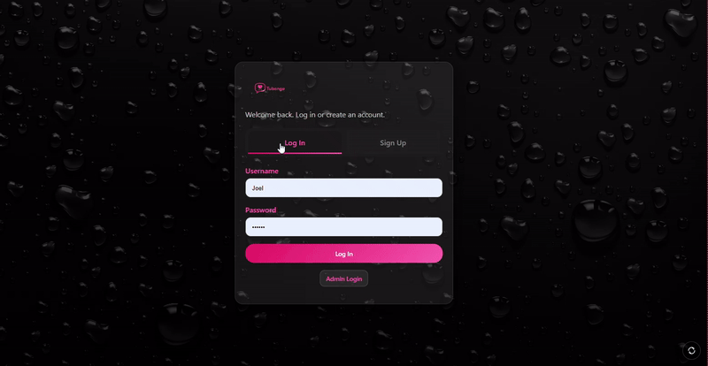

 
[link](https://tubongechat.netlify.app)
# Tubonge

**Features**
- Username + password sign up and login with session persistence (no personal data is collected like phone number and email).
- Admin login path and admin console for managing group messages.
- Group chat with realtime updates.
- 1:1 private chat threads with user selection.
- Online presence tracking with online/offline badges and live online count.
- User list with desktop sidebar and mobile users tab.
- Unread private chat badge and per-thread unread highlighting.
- Read receipts for private messages (`Sent` / `Read`).
- Message replies in group chat with reply preview and inline reply block.
- Image sharing in group and private chats with upload progress.
- Voice messages (15s max) with recording timer and waveform indicator.
- Profile editor (display name, bio, avatar selection).
- Profile viewer modal from message/user avatars.
- Message avatars with per-user accent colors.
- Sticky message composer with mobile keyboard visibility handling.
- Responsive, glassmorphism-styled UI with tabs and mobile optimizations.
- Manual reload button on key pages.

## Android APK workflow

This repo now includes a GitHub Actions workflow at `.github/workflows/android-apk.yml`.

- It builds a debug APK on pushes to `main` or `master`, on pull requests, and on manual `workflow_dispatch`.
- Before building, it syncs the latest root web files into `mobile-apk/www` with `npm run sync:web`.
- The workflow expects a GitHub secret named `ANDROID_GOOGLE_SERVICES_JSON` containing the raw contents of your Firebase Android `google-services.json`.
- The generated artifact is uploaded to the workflow run as `tubonge-debug-apk`.

## Android push notifications

True Android background or closed-app notifications are wired through Firebase Cloud Messaging.

- Place the real Firebase Android config file at `mobile-apk/google-services.json`. A template lives at `mobile-apk/google-services.json.example`.
- Send notifications from one backend option:
  - deploy the Firebase Functions in `functions/` to the `dtubonge` project, or
  - use the Netlify scheduled function in `netlify/functions/push-dispatch.mjs`, or
  - run the standalone Node sender in `push-server/`
- The Android app registers its device token under `users/{username}/devices/{installationId}` and removes it on logout.

## Netlify push function

If your site is already on Netlify, you can send FCM push notifications without Firebase Functions by using the scheduled function in `netlify/functions/`.

- Netlify will poll `notification_queue` every minute and send pending push notifications.
- Add one of these Netlify environment variables:
  - `FIREBASE_SERVICE_ACCOUNT_JSON`
  - `FIREBASE_SERVICE_ACCOUNT_BASE64`
- Optional environment variables:
  - `FIREBASE_DATABASE_URL`
  - `FIREBASE_PROJECT_ID`
  - `NETLIFY_PUSH_BATCH_SIZE`
- Scheduled functions only run on published deploys.
- Because this is scheduled polling, delivery can be delayed by up to about one minute.

## Node push server alternative

If you do not want to use Firebase Functions on Blaze, a standalone Node sender is available in `push-server/`.

- It watches the Realtime Database directly and sends FCM notifications with Firebase Admin.
- It needs a Firebase service account JSON file and an always-on place to run.
- Setup instructions are in `push-server/README.md`.
